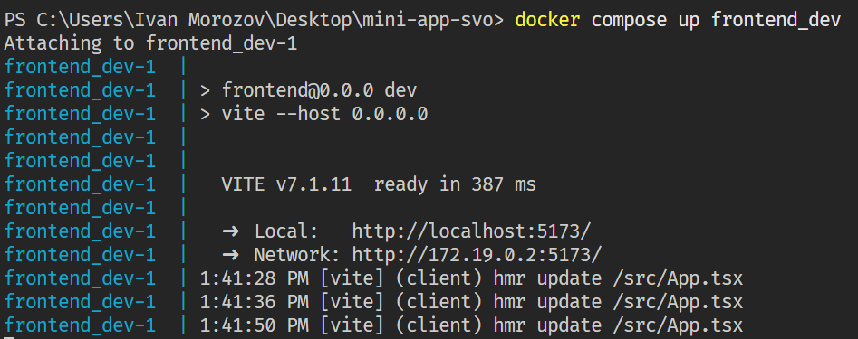
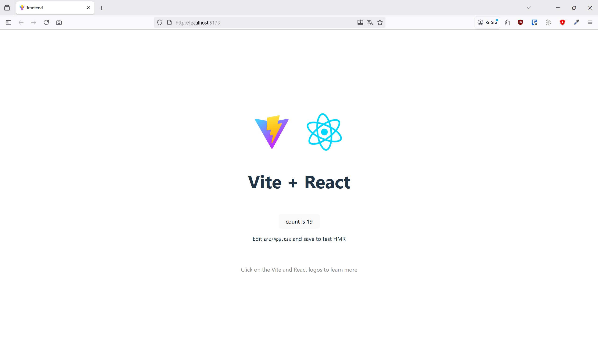

# SVO mini app

## Технологический стек:

Бэкенд

    FastAPI
    SQLite
    Tortoise-ORM
    Python 3.11+

Фронтенд

    React 
    Vite
    TypeScript
    UI Kit 
    React Query 

Инфраструктура

    Docker/Docker Compose 

## Запуск для разработки

### Frontend

1. Установить Docker на машину: [Тык](https://docs.docker.com/desktop/?_gl=1*1peqskd*_gcl_au*OTIzMjEyNDMzLjE3NjA5Njc4NjI.*_ga*MTc1MDQ4MTAzOS4xNzU4NzIzNzY3*_ga_XJWPQMJYHQ*czE3NjA5NjU5NzkkbzYkZzEkdDE3NjA5Njc4NjUkajU3JGwwJGgw)

2. Запустить из корня репозитория ```docker compose up frontend_dev```
3. Из консоли увидеть, что все собрано, запущено:


Изменения в frontend/src монтируются в контейнер. Можно разрабатывать! :)
