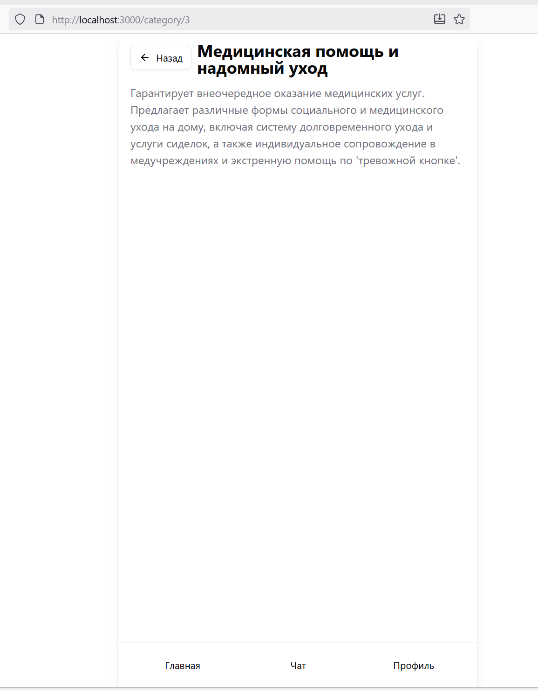

# Проект из backend и frontend для Мини Аппа СВО в мессенджере Max

Будет поставляться в docker контейнерах на сервер через Docker Compose

## Frontend

Документация находиться [тут](frontend/)

Дизайн макет [тут](https://www.figma.com/design/m9qwbE68W8hkMMF4YN5tBS/%D0%A0%D0%B0%D0%B1%D0%BE%D1%82%D0%B0?node-id=33-2&t=0Gw9RJIDmnxnhVQ5-1)

## Backend

Пока не используется, так как нарисовать фронт пока можно и без него

## Деплой на GitHub Pages

Приложение настроено для статического деплоя на GitHub Pages с поддержкой глубоких ссылок и работы в подпути репозитория.

### Настройка GitHub Pages

1. **Включите GitHub Pages в настройках репозитория:**
   - Перейдите в `Settings` → `Pages`
   - В разделе `Source` выберите `GitHub Actions`
   - Сохраните изменения

2. **URL приложения:**
   - После первого деплоя приложение будет доступно по адресу:
   - `https://YOUR_USERNAME.github.io/REPO_NAME/`
   - Например: `https://username.github.io/mini-app-svo/`

3. **Автоматический деплой:**
   - Деплой запускается автоматически при каждом push в ветку `main`
   - Также можно запустить вручную через `Actions` → `Deploy to GitHub Pages` → `Run workflow`

### Локальная сборка

Для локальной сборки со статическим экспортом:

```bash
cd frontend
npm install
BASE_PATH=/REPO_NAME npm run build
```

Собранные файлы будут в директории `frontend/out/`.

### Настройка BASE_PATH

По умолчанию используется имя репозитория как BASE_PATH. Для изменения:

1. В GitHub Actions workflow (`.github/workflows/pages.yml`) измените:
   ```yaml
   BASE_PATH: /${{ github.event.repository.name }}
   ```

2. Или установите переменную окружения в настройках репозитория (Settings → Secrets and variables → Actions)

### Особенности

- ✅ Полностью статическая сборка (без SSR)
- ✅ Поддержка глубоких ссылок (deep links работают при перезагрузке)
- ✅ Работа в подпути репозитория
- ✅ Автоматический деплой через GitHub Actions
- ✅ SPA fallback (404.html для GitHub Pages)

## Текущее состояние

- Frontend
  - **Общее**
  - [x] Структура проекта, роутинг страниц
  - [x] Анимации
    - [x] Прототип
    - [x] Нормальная версия
  - [x] Deploy скрипт
  - [ ] Тесты
  - **Блоки**
  - [ ] Главная страница
    - [x] Макет
    - [ ] Дизайн
    - [ ] Карточка с услугами
  - [ ] Чат
    - [x] Макет
    - [ ] Дизайн
  - [ ] Профиль
    - [x] Макет
    - [ ] Дизайн
  - [ ] Нижнее меню
    - [x] Макет
    - [ ] Дизайн
    - [ ] Иконки
  - API взаимодействие
    - [x] Мок API
    - [ ] Нормальное API
- Backend
  - Пока пауза

## Скриншоты (история)

- 23.10.2025 - Тупо макет и настройка проекта. Но все кликается, переходит на разные стр.

	